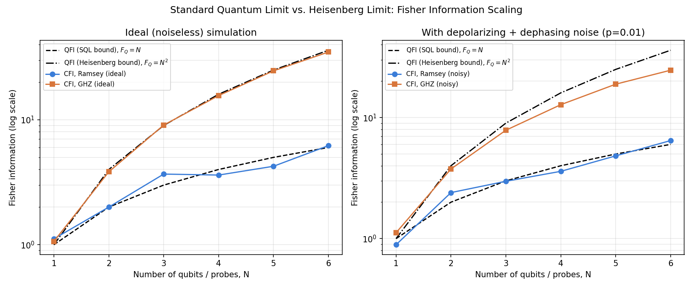

# Fisher Information Limits for Phase Estimation: Ramsey vs. GHZ Interferometry

A quantum sensing / metrology project extending the theoretical framework of my M.Sc. thesis, *Balanced Homodyne Detection without Coherent State Local Oscillator* (Universität Paderborn, 2026, advisors: Prof. Dr. Jan Sperling, Prof. Dr. Torsten Meier), from the continuous-variable homodyne setting into discrete-variable, gate-model quantum computing.

## What this project does

The thesis characterizes how precisely a quadrature/phase can be extracted from a continuous-variable homodyne measurement, and shows that squeezed light can push that precision below the shot-noise level set by a classical (coherent-state) local oscillator. This project asks the same question in the qubit picture: **how precisely can a phase be estimated from N qubits, and how does entanglement change the answer?**

It implements, in Qiskit:

- **Ramsey interferometry** on N independent qubits → Classical/Quantum Fisher Information scales as N (the **Standard Quantum Limit**, the DV analog of shot-noise-limited coherent-state phase estimation).
- **GHZ-state interferometry** on N entangled qubits → Fisher information scales as N² (the **Heisenberg limit**), the discrete-variable counterpart of what squeezing achieves in the thesis's continuous-variable framework.
- **Numerical estimation of the Classical Fisher Information** directly from simulated measurement statistics (finite-difference on measured outcome probabilities), rather than assuming it analytically — mirroring the thesis's calibration-from-measured-data philosophy.
- **A depolarizing + dephasing noise model**, showing that the GHZ state's Heisenberg-scaling advantage erodes under realistic decoherence — the natural bridge to the next project in this series (LO-agnostic-style calibration and noise mitigation for entangled sensing probes).

See `theory_notes.md` for the full derivation and an explicit table mapping every quantity in this project back to its counterpart in the thesis (φ ↔ θ, δ̂(φ) ↔ parity measurement, squeezed-vacuum signal ↔ GHZ entangled probe, etc.).

## Results



Left: in the noiseless simulation, the GHZ probe's Classical Fisher Information tracks the Heisenberg bound (F_Q = N²) closely, while independent-qubit Ramsey measurements track the Standard Quantum Limit (F_Q = N), exactly as quantum estimation theory predicts.

Right: under a modest depolarizing/dephasing noise model (p = 0.01 per gate), the GHZ probe's advantage over the SQL visibly shrinks as N grows — entanglement buys precision but costs noise robustness, the same trade-off the thesis explores for squeezed light under thermal noise and excess classical noise (Ch. 5, stress tests).

## Files

- `theory_notes.md` — full Fisher information / Cramér–Rao derivation, with an explicit thesis-to-project notation map.
- `phase_estimation.py` — Qiskit implementation: circuit builders, noise model, CFI estimator, and the comparison plot.
- `fisher_information_scaling.png` — output figure.

## Requirements

```
qiskit
qiskit-aer
numpy
matplotlib
```

## Run it

```bash
python3 phase_estimation.py
```

## Next in this series

A companion project applying the thesis's own calibration methodology (law of total variance, LO-agnostic squeezing criterion D) to characterize and partially mitigate the noise-induced Fisher information loss shown above for entangled sensing probes.
