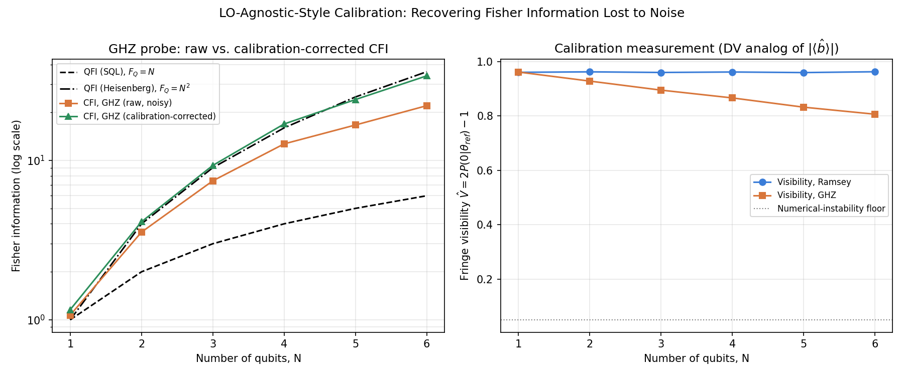

# LO-Agnostic-Style Calibration for Entangled Sensing Probes

A quantum sensing / metrology project extending my M.Sc. thesis's calibration methodology — the law of total variance and vacuum-substitution procedure from *Balanced Homodyne Detection without Coherent State Local Oscillator* (Universität Paderborn, 2026) — into the discrete-variable, gate-model setting. This is the direct follow-on to **Project 1** (`01-fisher-information-limits/`), which showed that a GHZ-entangled qubit probe's Heisenberg-scaling phase-estimation advantage erodes under realistic decoherence.

## The question this project answers

Project 1 left an open problem: how much of the Fisher information lost to noise can be recovered using only calibration measurements, without assuming a specific noise model? The thesis solves exactly this kind of problem for homodyne detection — it never assumes the local oscillator's noise analytically; it measures it directly, by blocking the signal and substituting vacuum (thesis Table 4.1), then subtracts it out (thesis Eq. 4.3). This project builds the discrete-variable analog of that procedure.

**The key translation**: in the Ramsey/GHZ circuits, the ideal measurement fringe P(θ) = ½(1 + cos(kθ)) has its *amplitude* — the visibility V — contracted by decoherence, exactly as the thesis's LO mean field |⟨b̂⟩| attenuates the interference term under noise. So:

- **Calibration step** (DV analog of thesis Table 4.1, Steps 1–2): run the circuit at a *known* reference angle θ = 0, under the same noise channel as the real experiment, and measure the visibility directly: V̂ = 2·P(0|θ=0) − 1.
- **Correction step** (DV analog of thesis Eq. 4.3): rescale the raw, noise-degraded Fisher information estimate by 1/V̂² to recover a calibrated estimate.

See `theory_notes.md` for the full derivation and an explicit table mapping every step of this project back to the corresponding thesis equation.

## Results



Left: for the GHZ probe, the calibration-corrected CFI (green) tracks the ideal Heisenberg-bound QFI far more closely than the raw noisy CFI (orange) — at N = 6, calibration recovers roughly 85% of the Fisher information gap left by decoherence, without ever assuming the noise model's exact form.

Right: the calibration measurement itself. The GHZ probe's visibility degrades markedly faster with N than the single-qubit Ramsey probe's — a direct, measured demonstration that entangled probes are more fragile to noise, and exactly why a calibration step is necessary in the first place.

One important caveat, carried over directly from the thesis (§3.2, "Condition 2: Practical Signal-to-Noise Requirement"): as visibility drops toward zero, dividing by V̂² amplifies statistical noise in the corrected estimate — the calibration becomes theoretically valid but numerically unstable, exactly the same failure mode the thesis identifies for a weak local oscillator. This project reports where that instability floor sits (see `theory_notes.md`, §3.1).

## Files

- `theory_notes.md` — full derivation, with an explicit thesis-Table-4.1-to-project mapping.
- `noise_calibration.py` — Qiskit implementation: circuit builders (ported from Project 1), noise model, visibility calibration, and the CFI correction.
- `calibration_recovery.png` — output figure.

## Requirements

```
qiskit
qiskit-aer
numpy
matplotlib
```

## Run it

```bash
python3 noise_calibration.py
```

## How this fits your two-project narrative

Project 1 asks: *what precision is achievable, and what does entanglement buy you?* Project 2 asks: *when noise takes some of that precision away, how much can a calibration procedure — with no assumptions about the noise itself — give back?* Both questions, and both answers, are lifted directly from the structure of your thesis (precision limits via the covariance/variance formalism; LO-state-independent calibration via the law of total variance), just carried from the continuous-variable homodyne setting into the discrete-variable gate model. That continuity is the strongest thing about this pair of projects for a CV — they read as one coherent research program, not two unrelated demos.
