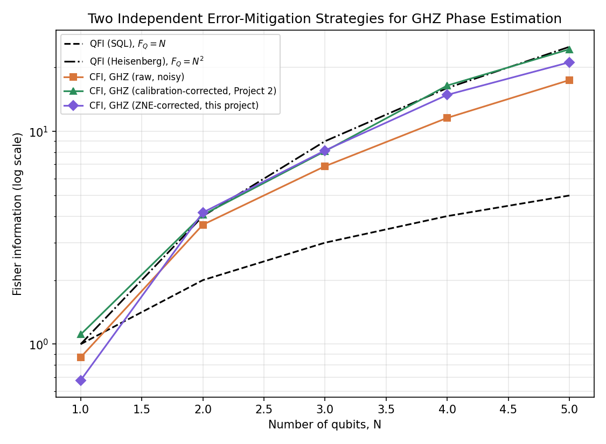

# Zero-Noise Extrapolation for Quantum Sensing: Gate Folding vs. Calibration

A quantum sensing / error-mitigation project extending the noise-robustness philosophy of my M.Sc. thesis, *Balanced Homodyne Detection without Coherent State Local Oscillator* (Universität Paderborn, 2026), into a second, independent error-mitigation strategy — complementing **Project 2**'s calibration-based correction with **Zero-Noise Extrapolation (ZNE)** via unitary gate folding.

## What this project does

Project 2 recovered Fisher information lost to decoherence in a GHZ-entangled sensing probe using a calibration measurement (a direct DV analog of the thesis's vacuum-substitution procedure). This project asks: does an entirely independent mitigation strategy — one that needs no reference measurement at all — recover a comparable amount?

**Zero-Noise Extrapolation**: each circuit's unitary U is deliberately "folded" into U(U†U)^k, which is mathematically identical to U for a perfect circuit but physically injects k extra round trips of real gate noise. Running at fold factors λ = 1, 3, 5 traces out how the measured probability degrades as noise is deliberately amplified, and a linear (Richardson) extrapolation back to λ → 0 estimates the zero-noise result.

This mirrors, in a quantitative form, exactly what the thesis's Chapter 5 stress tests do qualitatively: deliberately increase the noise in the model and verify the protocol still recovers the correct answer.

## Results



Both the calibration-based correction (Project 2, green) and the ZNE-based correction (this project, purple) track the ideal Heisenberg-bound QFI far more closely than the raw, uncorrected CFI (orange) — and largely agree with each other, which is the important result here: two independent mitigation strategies converging on the same corrected value is much stronger evidence than either one alone.

Where they diverge slightly at higher N, that's informative too: ZNE's accuracy depends on how well a low-order polynomial captures the true noise-scaling law, while the calibration method's accuracy depends on the reference measurement staying valid across the run — different assumptions, different failure modes, exactly the kind of trade-off a careful error-mitigation section should discuss.

## Files

- `theory_notes.md` — full derivation, with an explicit mapping to the thesis's Chapter 5 robustness/stress-test methodology.
- `zne_mitigation.py` — Qiskit implementation: gate folding, Richardson extrapolation, and the side-by-side comparison against Project 2's calibration correction.
- `zne_vs_calibration.png` — output figure.

## Requirements

```
qiskit
qiskit-aer
numpy
matplotlib
```

## Run it

```bash
python3 zne_mitigation.py
```

## Series overview

This is Project 3 of 3 in a single coherent research program extending the thesis into the gate-model setting:

1. **`01-fisher-information-limits/`** — what precision is achievable, and what does entanglement buy you? (SQL vs. Heisenberg scaling)
2. **`02-lo-agnostic-calibration/`** — how much of that precision, once lost to noise, can a calibration measurement give back? (thesis-style vacuum-substitution, translated to DV)
3. **`03-zero-noise-extrapolation/`** (this project) — does an independent mitigation strategy agree, and how do the two compare?
